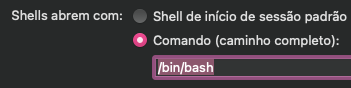

# CommonCommands

Este projeto tem como finalidade reunir e facilitar comandos criados no bash.

Para baixar e acessar a primeira vez, execute o seguinte código no Terminal:

> Tenha em mente que serão sobrescritos o arquivo `.inputrc` e uma possível pasta `.commands` (caso estes exitam)

```shell
/bin/bash -c "$(curl -fsSL https://gitlab.com/c8273/commoncommands/-/raw/master/install.sh)"
```

Acesse as configurações do Terminal, na aba *Geral* e troque o **início padrão** para **Comando** e `/bin/bash`:



Feito isto, basta reiniciar o terminal e utilizar!